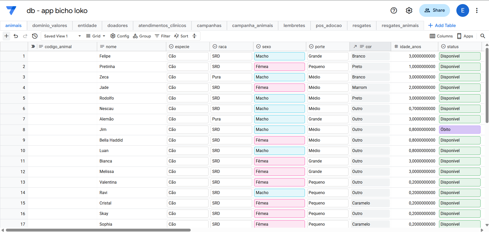
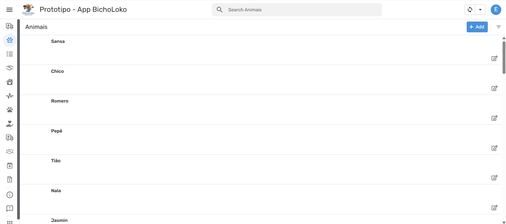
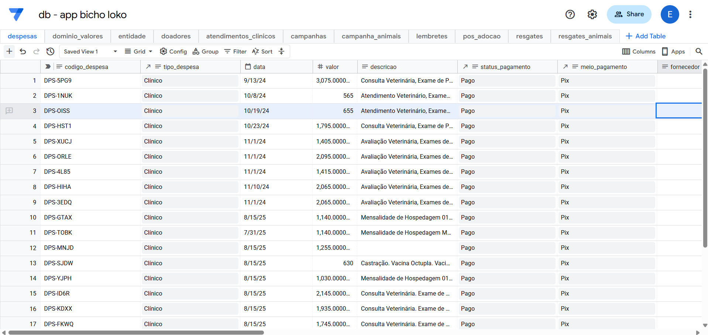
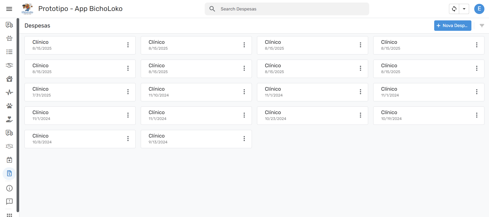
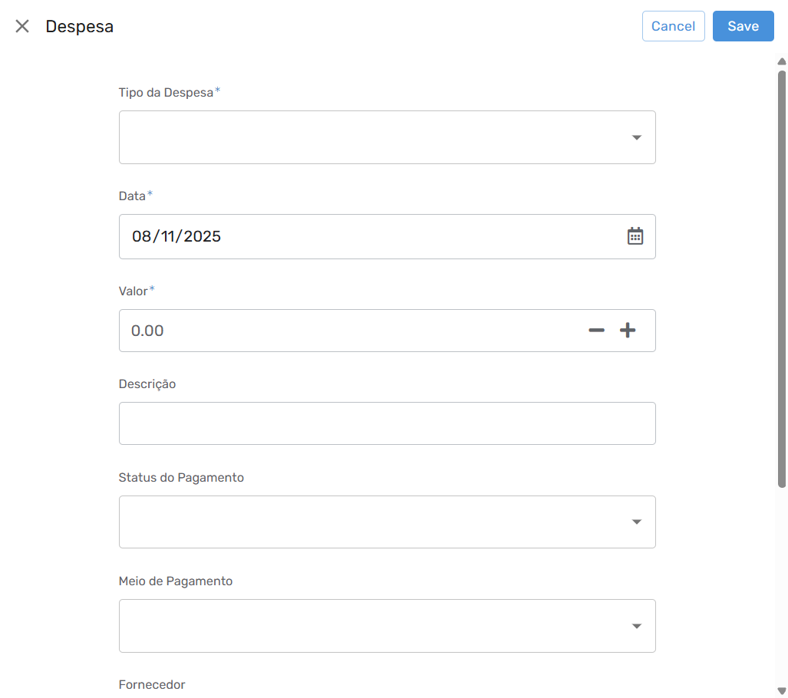
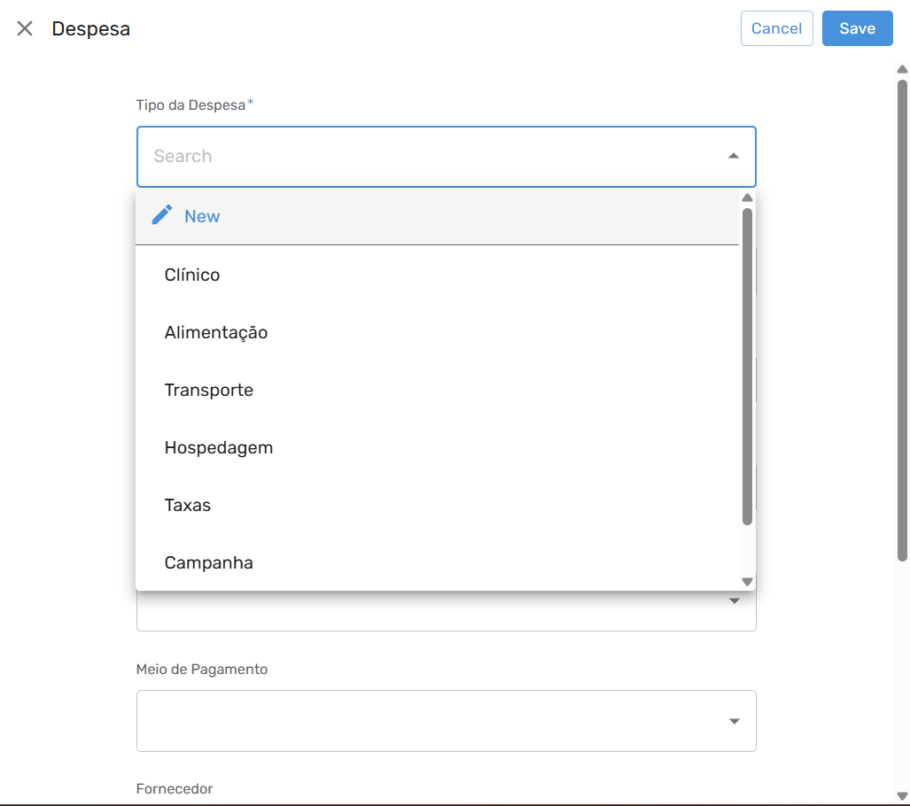
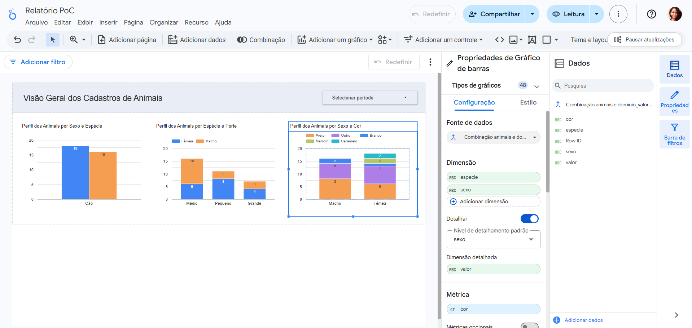
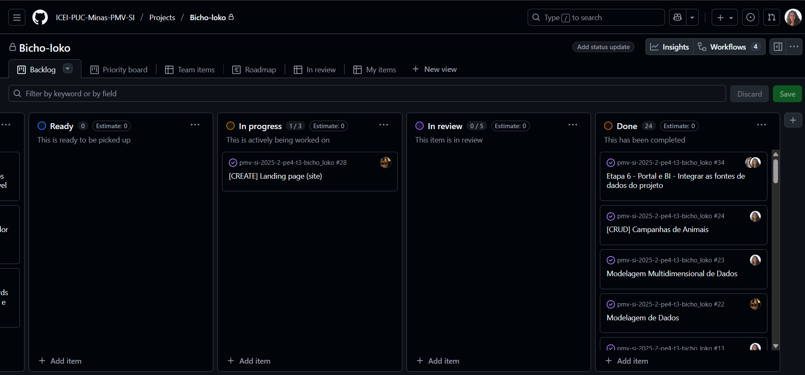

[Voltar](../README.md)

## Processo ETL

A ONG atualmente mantém suas informações em formato físico, armazenadas em documentos impressos.
Esses registros incluem dados sobre termos de adoção, doações recebidas e atendimentos prestados.
O primeiro passo do projeto foi digitalizar essas informações para permitir o uso em um sistema informatizado (AppSheet) e, posteriormente, integrá-las a uma ferramenta de Business Intelligence (BI).

| **Origem**                                                        | **Tipo de dado**                                                                                     | **Forma de digitalização**                                                                                                                                                  | **Armazenamento final**                                 |
| ----------------------------------------------------------------- | ---------------------------------------------------------------------------------------------------- | --------------------------------------------------------------------------------------------------------------------------------------------------------------------------- | ------------------------------------------------------- |
| **Termos de adoção (físico)**                                     | Informações do adotante, do animal e do processo de adoção.                                          | Digitação manual via AppSheet, com divisão lógica em três tabelas: `Adotantes` (dados pessoais), `Animais` (dados do animal) e `Adoções` (ligação entre adotante e animal). | Tabelas `adotantes`, `animais` e `adocoes`              |
| **Relatórios de Execução (físico)**                               | Informações sobre resgates e atendimentos: contexto, exames realizados, gastos e adoções do período. | Digitação manual via AppSheet, registrando cada operação e seus detalhes.                                                                                                   | Tabelas `resgates`, `atendimentos_clinicos` e `adocoes` |
| **Doações, voluntariado e campanhas (dados ainda não recebidos)** | Registros de doações financeiras, materiais, campanhas e participação de voluntários.                | Estrutura preparada no AppSheet para inserção manual futura.                                                                                                                | Tabelas `doacoes`, `voluntarios` e `campanhas`          |

Além dessas tabelas, o modelo de dados contempla entidades de apoio, como entidade, que centraliza informações pessoais comuns a diferentes perfis (adotantes, doadores e voluntários), e tabelas de relacionamento, como campanha_animal, que permitem associar animais a uma campanha.
Essas estruturas garantem integridade e flexibilidade, favorecendo análises futuras no ambiente de BI.

### Etapas do processo ETL

#### Extração

Os dados originalmente físicos foram digitados manualmente pela equipe do projeto (PUC) diretamente no AppSheet.
Esse processo representa a etapa de extração, pois converte informações em papel em registros digitais no banco SQL associado ao AppSheet.
Futuramente, essa atividade será realizada pela própria equipe da ONG, conforme novos registros forem sendo gerados no dia a dia (adoções, atendimentos, doações, etc.).

#### Transformação

Durante a etapa de digitação e modelagem, são aplicadas padronizações e regras de consistência para garantir a integridade dos dados inseridos no sistema.
Entre as principais ações realizadas, destacam-se:

- Separação dos campos data_evento e data_precisao, permitindo registrar informações com diferentes níveis de detalhe (ano, mês e dia);
- Centralização de dados pessoais na tabela entidade, evitando redundâncias entre adotantes, doadores e voluntários;
- Revisões manuais pontuais, realizadas pela equipe no momento do cadastro, para verificar consistência de informações e relacionamentos (ex.: vincular corretamente um atendimento a um animal);
- Validações automáticas no AppSheet, como campos obrigatórios, listas de opções controladas (ex.: espécie, sexo) e restrições de tipo, garantindo a padronização das entradas.

No futuro, colaboradores capacitados da ONG poderão realizar transformações mais avançadas diretamente no banco SQL, permitindo ajustes estruturais, normalização ou limpeza de dados de forma automatizada conforme a necessidade.

#### Carga

Os dados tratados são integrados ao Looker Studio, ferramenta escolhida para atuar como ambiente analítico (data warehouse).
A conexão é direta com o banco SQL do AppSheet, permitindo atualização automática dos painéis e relatórios sempre que novos registros são inseridos, sem necessidade de exportações manuais.

### Ferramenta ETL

A ferramenta escolhida para o processo ETL é o Looker Studio, pela sua integração nativa com bancos SQL e compatibilidade com o ecossistema Google, já utilizado pela ONG por meio do AppSheet.
Manter todo o fluxo dentro do mesmo ambiente tecnológico garante:

- Padronização e segurança dos dados;
- Facilidade de manutenção e compartilhamento;
- Redução de custos com infraestrutura e suporte técnico.

Essa solução é adequada à realidade da ONG, que não possui equipe de TI própria. O uso do Looker Studio proporciona uma solução em nuvem, acessível, sustentável e de fácil operação, permitindo que a equipe visualize indicadores sem depender de recursos técnicos avançados.

### Planejamento e Execução de Jobs

Para organizar o processo e assegurar a atualização contínua dos dados, o ETL foi dividido em três jobs principais, conforme descrito abaixo:

| **Job**                           | **Descrição**                                                                                     | **Responsável Atual**             | **Responsável Futuro**                                          | **Frequência / Forma de Execução**                    |
| --------------------------------- | ------------------------------------------------------------------------------------------------- | --------------------------------- | --------------------------------------------------------------- | ----------------------------------------------------- |
| **Extração dos dados**            | Inserção manual das informações da ONG no AppSheet, substituindo registros físicos.               | Equipe da PUC (projeto acadêmico) | Equipe administrativa da ONG                                    | Contínuo (à medida que novas informações são geradas) |
| **Transformação e padronização**  | Aplicação de regras de consistência e padronização (datas, relacionamentos, campos obrigatórios). | Equipe da PUC                     | Colaborador técnico ou voluntário com conhecimentos necessários | Conforme necessidade ou atualização de dados          |
| **Carga e atualização analítica** | Conexão automática do banco SQL com o Looker Studio e atualização dos relatórios.                 | Looker Studio (automático)        | Looker Studio (automático)                                      | Atualização em tempo real                             |

## Evidências

As imagens a seguir apresentam registros visuais das etapas práticas do processo ETL, comprovando a execução e os resultados obtidos em ambiente real.  
Foram utilizadas telas tanto do banco de dados SQL associado ao AppSheet quanto da própria interface do aplicativo, evidenciando a correspondência entre os dados físicos digitalizados e os registros armazenados no sistema.

### Extração

As imagens abaixo ilustram a etapa de **extração**, na qual os dados originalmente físicos foram convertidos em registros digitais.  
Observa-se a base de dados já populada com informações referentes a **animais** e **despesas** — resultado do processo de digitação manual realizado pela equipe do projeto no AppSheet.

|                                     Banco de Dados Populado                                     |                                              AppSheet                                               |
| :---------------------------------------------------------------------------------------------: | :-------------------------------------------------------------------------------------------------: |
|   |   |
|  |  |

### Transformação

A etapa de **transformação** é evidenciada pelas telas de cadastro no AppSheet, que demonstram a aplicação de regras de consistência e padronização dos dados.  
Entre os principais mecanismos observados estão:

- **Validação automática de campos obrigatórios**, identificada pelo asterisco (\*) nos formulários;
- **Listas de opções controladas**, que limitam a inserção de valores para o tipo de despesa, garantindo uniformidade nas categorias;
- **Relacionamentos entre tabelas**, como a associação direta entre uma despesa e o animal correspondente, assegurando integridade referencial.

|                                                                                                              |                                                                                                |                                                                                                |
| :----------------------------------------------------------------------------------------------------------: | :--------------------------------------------------------------------------------------------: | :--------------------------------------------------------------------------------------------: |
|  |  |  |

### Carga

Embora essa dashboard demonstre uma integração funcional entre o AppSheet e o Looker Studio, ela representa apenas uma evidência prática da conexão entre as plataformas. Ressalta-se que o painel apresentado não está diretamente relacionado à modelagem multidimensional desenvolvida anteriormente, uma vez que ainda não há dados suficientes cadastrados no aplicativo para alimentar o modelo.

## Plano de Trabalho

O Plano de Trabalho está organizado no GitHub Projects. Você pode acessá-lo e acompanhar o andamento [clicando aqui](https://github.com/orgs/ICEI-PUC-Minas-PMV-SI/projects/351/views/1):

