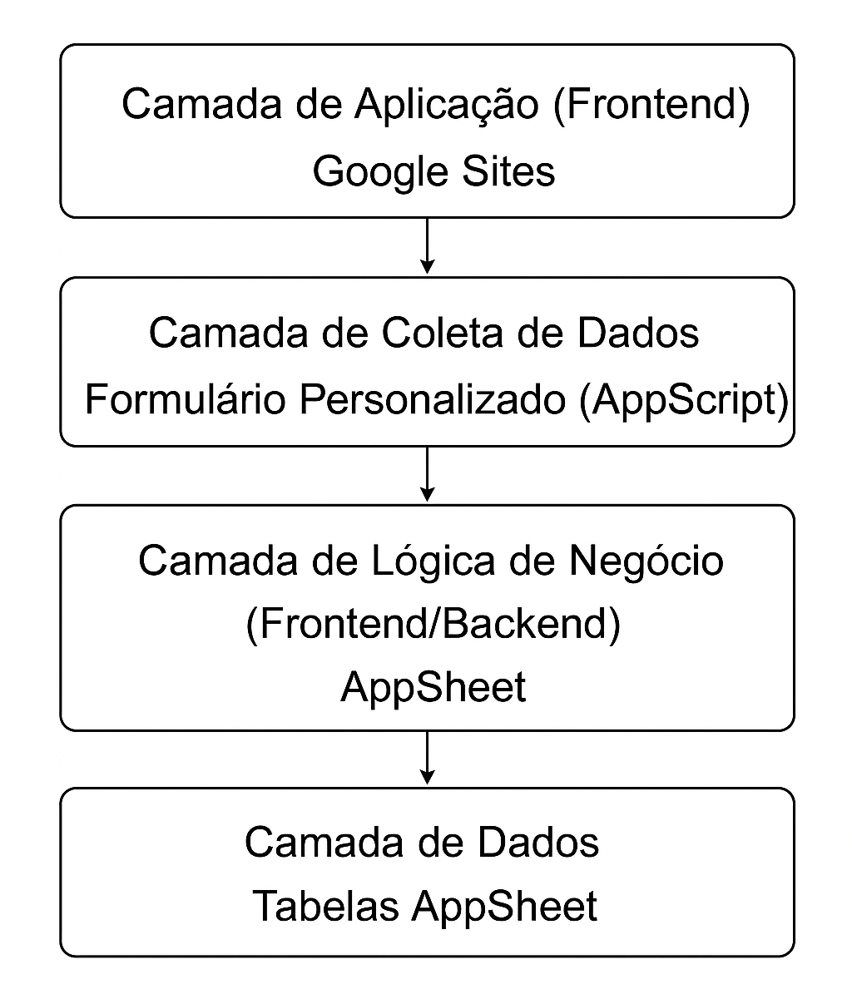

[Voltar](../README.md)

# **METODOLOGIA**

A execução do projeto seguirá metodologia ágil, com aplicação adaptada do framework **Scrum**, permitindo entregas incrementais e acompanhamento contínuo do progresso. A função de **Scrum Master** será desempenhada por **Ana Carolina Fernandes de Assis**, responsável por organizar as tarefas, acompanhar prazos e promover a integração entre a equipe acadêmica e a ONG Bicho Loko.

As principais atividades metodológicas incluem:

- **Reuniões de levantamento de requisitos**: encontros online com a ONG para identificar necessidades e validar as informações a serem contempladas no sistema.

- **Oficinas de capacitação interna**: nivelamento dos integrantes quanto ao uso de **AppScript**, **AppSheets** e **Google Sites**, garantindo a qualidade da entrega.

- **Construção da base de dados**: estruturação de um banco de dados integrado no **AppSheet**, organizado em tabelas temáticas que abrangem as informações sobre **animais, adotantes, voluntários, castrações, parceiros, doadores, adoções, campanhas, despesas e interessados em adoção**. A modelagem foi planejada para garantir integridade referencial, facilidade de atualização e integração com as demais camadas do sistema.

- **Criação de formulário digital**: desenvolvimento de um **formulário personalizado** por meio do **Google AppScript**, incorporado ao portal institucional e ao aplicativo interno. Esse formulário possibilita o registro de novos adotantes e o envio de informações diretamente para o banco de dados da aplicação, assegurando a coleta estruturada e automatizada dos dados.

- **Desenvolvimento do dashboard**: implementação de **painéis interativos** no **AppSheet**, que consolidam os indicadores operacionais e estratégicos definidos em conjunto com a ONG. Os dashboards oferecem visualizações dinâmicas e atualizadas em tempo real, facilitando o acompanhamento das ações e o processo de tomada de decisão.

- **Validação incremental**: cada entrega parcial (planilha organizada, formulário ativo, dashboard inicial) será apresentada à ONG, coletando feedbacks e ajustes.

Essa abordagem permite uma implementação rápida, de baixo custo e com curva de aprendizado acessível, sem comprometer a qualidade do sistema de apoio à gestão da ONG.

## **ARQUITETURA**

Este item descreve a arquitetura de software projetada para a Organização Não Governamental (ONG) Bicho Loko, desenvolvida exclusivamente com o uso das ferramentas Google AppSheet, Google AppScript e Google Sites. A solução foi concebida para operação em ambiente de nuvem, com baixo custo de implantação, facilidade de manutenção e aderência estrita aos requisitos funcionais e não funcionais estabelecidos pelo projeto.

1. **Camada de Aplicação (Frontend)**:

   **Google Sites e AppSheet**

   A camada de aplicação compreende dois componentes distintos, voltados a públicos diferentes:

   - **Google Sites**: atua como o frontend público, servindo como portal institucional responsivo da ONG. Destina-se à divulgação de campanhas, histórias de adoção, informações institucionais e acesso a formulários e aplicações internas. O portal possui páginas configuráveis, com áreas públicas e áreas restritas, de acordo com a política de acesso definida.

   - **AppSheet**: constitui o frontend e backend interno do sistema, utilizado exclusivamente pela equipe da ONG. Nessa plataforma são realizadas as operações internas, como cadastro, acompanhamento de animais, controle de adoções e gerenciamento de voluntários. O AppSheet oferece interface responsiva e integração direta com as tabelas de dados hospedadas em nuvem.

2. **Camada de Coleta de Dados**

   **Formulário Personalizado (AppScript)**

   - A camada de coleta de dados é responsável por capturar, registrar e integrar informações estruturadas ao sistema. O formulário, desenvolvido por meio do **Google AppScript** oferece integração direta com as planilhas do **AppSheet**.
   - As respostas são automaticamente armazenadas nas tabelas da aplicação, garantindo a centralização e integridade dos dados.
   - Além da coleta de novas informações, esta camada também contempla a **digitalização e integração de dados legados**, anteriormente registrados em formulários físicos. Esse processo faz parte do **procedimento de Extração, Transformação e Carga (ETL)**, assegurando a consolidação dos registros históricos no ambiente digital.

3. **Camada de Lógica de Negócio (Backend)**

   **AppSheet**

   - Implementação das regras de negócio, views, formulários de entrada, validações e fluxos previstos nos RFs;

   - Gerenciamento de permissões e políticas de acesso (ex.: Administrador, Voluntário com permissão de edição e Leitura apenas), em conformidade com os requisitos de segurança e privacidade;

   - Execução apenas das ações autorizadas, sem inclusão de automações, notificações ou bots não previstos nos RFs.

4. **Camada de Dados**

   **AppSheets Database**

   - Estrutura de dados organizada por entidades: Usuários, Animais, Adotantes, Voluntários, Campanhas, Parceiros, Adoções, Despesas, Atendimentos Clínicos, Resgates, Pós-adoções, Doadores, Candidatos, Hospedagens e Doações;

   - Formas de alimentação dos dados:

     - Entradas originadas por formulários Google Forms integrados;

     - Inserção manual direta no AppSheet, realizada por colaboradores da ONG a partir de registros físicos ou outros documentos existentes;

     - Inserção em tempo real pelo aplicativo AppSheet em campo (por exemplo, durante resgates).

   - Regras de validação e integridade implementadas no AppSheet para assegurar consistência dos registros e conformidade com os RFs.

5. **Camada de Business Intelligence (BI)**

   **Dashboards AppSheet**

   - Painéis operacionais e relatórios interativos integrados ao AppSheet para consulta e acompanhamento dos indicadores previstos nos RFs (ex.: lista de animais por status, relatórios de adotantes aprovados, resumos de campanhas);

   - Visualizações e filtros configurados conforme as necessidades operacionais da ONG.

6. **Infraestrutura em Nuvem**

   **Hospedagem Google (serverless)**

   - Todos os componentes (Google Sites, Google Forms e AppSheet) operam em infraestrutura de nuvem, sem necessidade de servidores dedicados;

   - Solução dimensionada para o porte da ONG, com custos alinhados ao uso e às políticas de planos das ferramentas.

7. **Considerações Finais**

Todas as funcionalidades implementadas corresponderão estritamente aos requisitos funcionais e não funcionais fornecidos. Não serão incorporadas automações, notificações ou bots que não constem nos requisitos iniciais.

A arquitetura foi concebida para priorizar a autonomia operacional da ONG, o baixo custo de implantação, bem como a facilidade de manutenção e evolução.

**Figura 1 – Arquitetura proposta do sistema da ONG Bicho Loko**

Fonte: elaborado pelos autores (2025).

## **ESTRUTURA PARA A REALIZAÇÃO DO PROJETO**

A estrutura necessária para a execução do projeto foi definida considerando a realidade da ONG Bicho Loko e o escopo estabelecido, priorizando o uso de ferramentas de fácil acesso, baixo custo e hospedagem em nuvem. Essa configuração visa garantir a viabilidade técnica, a sustentabilidade operacional e a autonomia da instituição após a implantação da solução.

### **Estrutura Tecnológica da ONG Bicho Loko**

Atualmente, a ONG Bicho Loko realiza a gestão de adoções de forma manual, utilizando formulários impressos para registrar informações de adotantes e animais. Esses documentos são armazenados em armários cedidos por uma clínica veterinária parceira, o que limita o acesso e a atualização dos dados, além de aumentar o risco de extravio ou deterioração das informações.

A divulgação das campanhas e dos animais disponíveis para adoção é feita exclusivamente pelas redes sociais — principalmente **Instagram** e **Facebook** —, sem a existência de um **portal institucional** que concentre informações e facilite o relacionamento com o público.

Com o objetivo de **modernizar e automatizar os processos**, foi proposta uma arquitetura tecnológica integrada baseada em **Google Sites, AppScript e AppSheet**. O **Google Sites** funcionará como o **portal institucional** da ONG, centralizando a divulgação de campanhas e o acesso a formulários digitais personalizados. O **AppScript** será utilizado para automatizar os formulários e integrar diretamente os dados ao banco em nuvem. Já o **AppSheet** atuará como **plataforma central de gestão**, permitindo o registro, acompanhamento e análise das informações relativas a adoções, doações, voluntários, parceiros e campanhas em um único ambiente.

Um dos principais benefícios do **AppSheet** é a **geração de dashboards interativos**, que fornecem uma visão integrada das atividades da ONG e auxiliam na **tomada de decisão estratégica**. Serão desenvolvidos três painéis principais:

- **Início (Visão Geral)**: cards de contagem e listas rápidas sobre **animais, parceiros e voluntários**;

- **Financeiro**: consolidação dos **custos por tipo ou parceiro**, além da análise de **gastos e doações dos últimos 12 meses**;

- **BI Estratégico**: indicadores de **eficiência de adoção por canal** (Instagram, feiras, indicações), **mapa de custos por etapa** (castração, vacinas, tratamentos, transporte), **taxa de devolução por perfil de adotante** (tipo de moradia, região e faixa etária) e **custo médio por animal até a adoção**.

Esses painéis permitirão à ONG **monitorar suas atividades em tempo real**, aprimorar o planejamento e direcionar recursos de forma mais eficiente, ampliando sua capacidade de gestão e impacto social.

### **Recursos materiais e tecnológicos**

- **Computadores pessoais** dos integrantes do projeto, utilizados para o desenvolvimento e configuração das ferramentas.

- **Dispositivos móveis pessoais**, empregados para comunicação com a equipe e representantes da ONG via **WhatsApp**.

- **Conexão com a internet**, requisito essencial para utilização dos serviços em nuvem.

- **Aplicativos do Google**:

  - **AppScript**: coleta e automação de dados de adotantes e voluntários;

  - **AppSheet**: organização centralizada das informações em tabelas temáticas (Animais, Adotantes, Interessados, Voluntários, Campanhas e Parcerias) e desenvolvimento dos dashboards de apoio à decisão;

  - **Google Workspace**: armazenamento e compartilhamento dos arquivos do projeto;

  - **Google Sites**: criação do portal institucional responsivo da ONG.

### **Recursos humanos**

- **Equipe discente**, composta por alunos do curso de Sistemas de Informação, responsáveis pela análise, organização e implementação da solução.

- **Scrum Master designado pelo grupo**, encarregado da organização das atividades, do monitoramento de prazos e da facilitação da comunicação entre equipe e ONG.

- **Representante da ONG Bicho Loko**, responsável pela validação dos dados fornecidos, acompanhamento das entregas e posterior gestão da solução.

### **Justificativa da estrutura escolhida**

A adoção de ferramentas baseadas em nuvem e de fácil utilização está alinhada às necessidades e limitações da ONG, que não dispõe de infraestrutura própria de tecnologia da informação. Essa configuração garante:

- **Baixo custo operacional**, eliminando a necessidade de servidores ou licenças pagas;

- **Escalabilidade**, permitindo a expansão gradual com novos formulários e indicadores;

- **Autonomia da ONG**, possibilitando que a ONG gerencie e atualize seus próprios dados e painéis após a conclusão do projeto.

Assim, a estrutura definida assegurará uma implementação ágil, sustentável e de impacto social imediato, fortalecendo a transformação digital da ONG Bicho Loko.
