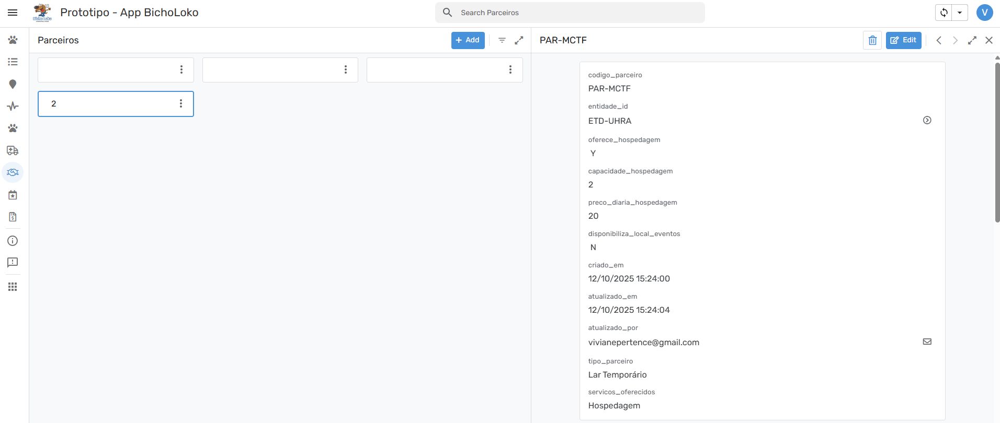

[Voltar](../README.md)

## Modelagem de Dados

## Modelagem Multidimensional de Dados

## Protótipo

### Campanhas

|                                                Desktop                                                 |                                             Mobile                                             |                                                                                                |                                                                                                |
| :----------------------------------------------------------------------------------------------------: | :--------------------------------------------------------------------------------------------: | :--------------------------------------------------------------------------------------------: | :--------------------------------------------------------------------------------------------: |
|                  |            |                                                                                                |                                                                                                |
|  |  |  |  |
|          |    |  |                                                                                                |
|              |        |                                                                                                |                                                                                                |

### Campanhas de Animais

|                                                Desktop                                                 |                                                 Mobile                                                 |                                                                                                        |     |
| :----------------------------------------------------------------------------------------------------: | :----------------------------------------------------------------------------------------------------: | :----------------------------------------------------------------------------------------------------: | :-: |
|          |            |                                                                                                        |     |
|  |  |  |     |
|  |    |                                                                                                        |     |
|      |      |      |     |

### Despesas

|                                            Desktop                                            |                                            Mobile                                             |                                                                                               |                                                                                               |
| :-------------------------------------------------------------------------------------------: | :-------------------------------------------------------------------------------------------: | :-------------------------------------------------------------------------------------------: | :-------------------------------------------------------------------------------------------: |
|          |            |                                                                                               |                                                                                               |
|  |  |  |  |
|  |    |  |                                                                                               |
|      |        |                                                                                               |                                                                                               |

### Atendimentos Clínicos

|                                                     Desktop                                                     |                                                    Mobile                                                     |                                                                                                               |     |
| :-------------------------------------------------------------------------------------------------------------: | :-----------------------------------------------------------------------------------------------------------: | :-----------------------------------------------------------------------------------------------------------: | :-: |
|      |      |
|  |  |  |

### Parceiros

|                                              Desktop                                              |                                             Mobile                                              |                                                                                                 |     |
| :-----------------------------------------------------------------------------------------------: | :---------------------------------------------------------------------------------------------: | :---------------------------------------------------------------------------------------------: | :-: |
|      |      |
|  |  |  |

## Plano de Trabalho

O Plano de Trabalho está organizado no GitHub Projects. Você pode acessá-lo e acompanhar o andamento [clicando aqui](https://github.com/orgs/ICEI-PUC-Minas-PMV-SI/projects/351/views/1). Cada integrante da equipe ficou responsável tanto pelo desenvolvimento do respectivo CRUD quanto pela elaboração do protótipo correspondente.

